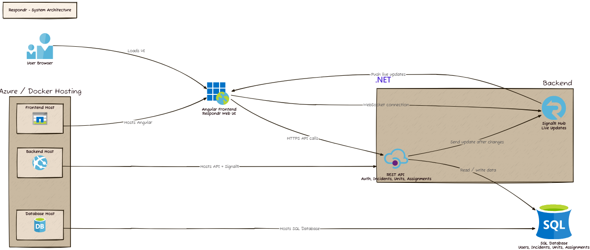

# Respondr System Architecture

## Purpose

This document describes the big-picture system context for Respondr. It explains the users, application boundaries, major components, and how the frontend, backend, database, and real-time layer interact.

This document is based on the planned Respondr architecture below.


## System Summary

Respondr is a browser-based emergency response operations application. Users access Respondr through a web browser. The Angular frontend provides the operational dashboard and user interface. The .NET backend exposes REST APIs for commands and queries, persists data through Entity Framework Core, and publishes real-time changes through SignalR.

## Users

### Dispatcher

The Dispatcher receives emergency reports and creates incident records. The Dispatcher needs fast incident entry, clear validation, and live visibility into what happens after an incident is created.

### Operations Lead

The Operations Lead coordinates response activity. The Operations Lead needs a dashboard view of active incidents, critical incidents, response unit availability, assignments, and live changes.

## External Actors

| Actor | Description | Interaction |
| --- | --- | --- |
| Dispatcher | Creates and updates incidents. | Uses Angular UI through browser. |
| Operations Lead | Assigns units and manages incident progress. | Uses Angular UI through browser. |
| Browser | Runtime environment for the web application. | Loads Angular assets, calls API, connects to SignalR. |

## System Boundary

Inside the Respondr system boundary:

- Angular frontend
- .NET Web API
- SignalR hub
- Database schema and persistence layer
- Authentication and authorization logic
- Incident, unit, assignment, and history modules

Outside the first-version system boundary:

- GPS tracking
- Native mobile app
- SMS provider
- Email provider
- External dispatch systems
- File storage
- AI services
- Multi-agency federation

## Component View

```text
User Browser
  -> Angular Frontend
      -> .NET REST API
          -> Database
      -> SignalR Hub
          -> Angular Frontend

Hosting
  -> Frontend Host
  -> Backend Host
  -> Database Host
```

## Major Components

### Angular Frontend

The Angular frontend is the main user interface for Respondr.

Responsibilities:

- Render login, dashboard, incident, response unit, assignment, and notification views.
- Manage client-side routing.
- Call backend REST APIs for commands and queries.
- Connect to the SignalR hub for live updates.
- Display real-time changes without page refresh.
- Enforce frontend-level route guards and role-aware UI behavior.
- Provide responsive layouts for desktop, tablet, and mobile browser sizes.

The frontend should not be the source of truth for business rules. It can guide the user, but backend validation must enforce rules.

### .NET Web API

The .NET backend is the server-side application layer.

Responsibilities:

- Authenticate users.
- Authorize role-specific actions.
- Expose REST endpoints for frontend operations.
- Validate commands.
- Coordinate incident, response unit, assignment, and history changes.
- Persist data through Entity Framework Core.
- Publish live updates through SignalR after successful changes.
- Return consistent error responses.

### SignalR Hub

SignalR provides live operational updates.

Responsibilities:

- Maintain real-time client connections.
- Push events when incidents are created or updated.
- Push events when units are assigned or status changes.
- Support dashboard refresh behavior.
- Notify users about important operational changes.

SignalR should not replace REST commands in the first version. It should notify clients that state changed and optionally provide enough payload to update the UI.

### Database

The database stores the durable operational state.

Responsibilities:

- Store users and roles.
- Store incidents.
- Store response units.
- Store assignments.
- Store incident update history.
- Store timestamps and audit fields.

The first version may use SQL Server or PostgreSQL. The application should use Entity Framework Core to keep provider-specific details isolated where possible.

## Data Flow

### Initial Page Load

1. Browser loads Angular assets from the frontend host.
2. Angular app initializes.
3. User logs in.
4. Angular requests current dashboard data from the .NET API.
5. Angular connects to SignalR.
6. User sees current operational state.

### Command Flow

1. User performs an action in Angular, such as creating an incident.
2. Angular sends an HTTPS request to the REST API.
3. API validates the user and request.
4. API writes the change to the database.
5. API records history if the action is operationally significant.
6. API publishes a SignalR event after the database commit.
7. API returns a response to the caller.
8. Connected clients update their UI.

### Real-Time Update Flow

1. Backend completes a change.
2. Backend sends an event to SignalR clients.
3. Frontend receives the event.
4. Frontend updates local state or refetches affected data.
5. UI highlights the new or changed item.

## Architecture Diagram Reference

The D2 diagram source identifies these main nodes:

- User Browser
- Angular Frontend / Respondr Web UI
- Backend
- REST API / Auth, Incidents, Units, Assignments
- SignalR Hub / Live Updates
- SQL Database / Users, Incidents, Units, Assignments
- Azure / Docker Hosting
- Frontend Host
- Backend Host
- Database Host

The diagram identifies these relationships:

| Source | Target | Relationship |
| --- | --- | --- |
| User Browser | Angular Frontend | Loads UI |
| Angular Frontend | REST API | HTTPS API calls |
| Angular Frontend | SignalR Hub | WebSocket connection |
| REST API | Database | Read/write data |
| REST API | SignalR Hub | Send update after changes |
| SignalR Hub | Angular Frontend | Push live updates |
| Frontend Host | Angular Frontend | Hosts Angular |
| Backend Host | Backend | Hosts API and SignalR |
| Database Host | Database | Hosts SQL database |

## Trust Boundaries

### Browser To Backend

The browser is not trusted. All commands from the frontend must be authenticated and validated by the backend.

### Backend To Database

The backend is the only application component that should directly access the database.

### SignalR Clients

SignalR clients must be authenticated. Live event delivery should respect the same authorization model as REST API data access.

## Non-Functional Expectations

### Reliability

The system should preserve data integrity even when multiple users update operational data at the same time.

### Usability

The system should prioritize clear status, readable tables, fast actions, and simple workflows.

### Auditability

Important changes should be traceable through timestamps, user IDs, and history records.

### Maintainability

Frontend and backend code should be organized by feature modules and shared infrastructure. Documentation should stay aligned with the implementation.

### Deployability

The system should run locally through Docker Compose and later deploy to Azure with the same logical service boundaries.
